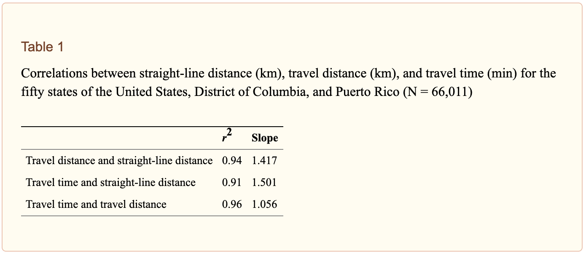

## CrowPy
[](https://pypi.org/project/crowpy/)

[](https://github.com/jcapili/crowpy/blob/master/LICENSE)

CrowPy (pronounced "*crow-pie*") uses Python to calculate the number of plane and truck miles traveled to deliver a USPS package. The name is a pun on the phrase "As the crow flies."

CrowPy was created to allow companies to easily track how many aggregate miles their packages have traveled in order to offset the associated carbon emissions :truck::package::evergreen_tree:

Here's a list of a few companies that can actually help you offset your emissions:
* [Pachama](https://pachama.com/)
* [Carbonfund.org](https://carbonfund.org/)
* [Wren](https://projectwren.com/)
* [Terrapass](https://www.terrapass.com/)

## Installation
Install using pip
```
pip install crowpy
```
Before you begin, you'll also need to register for a USPS API key [here](https://www.usps.com/business/web-tools-apis/welcome.htm).

## Usage
### calculateMiles()
- Inputs
    - **tracking**: A str of the USPS tracking number
    - **osrm**: flag; if True, use Open Street Map (OSRM) API to calculate ground miles via the shortest car route between the origin and destination. Otherwise, use a simple detour index detailed in [this](https://www.ncbi.nlm.nih.gov/pmc/articles/PMC3835347/) national study, where the detour index defined as travel distance divided by straight-line distance. Note that this detour index may suffice for short travel distances since it was calculated using a dataset involving distances to hospitals, but for USPS data, OSRM will likely be more accurate since shipping distances are often hundreds of miles. 
    
    
    
    - **printSteps**: flag; if True, print details for each leg of the journey (ground miles, air miles, origin and destination city + state, time between legs, estimated MPH)
    - **debugMode**: flag; if True will print details for each segment of the route for debugging purposes (whether the lat & lon were found via zipcode lookup, geolocate using the zipcode, or geolocate using the distribution city name, how many sec it took to process each step).
- Outputs
    - **truckMiles**: Number of miles the package traveled on the ground. For a given leg, calculate MPH as geodesic miles / time since the last event. If mph > 55 and miles > 60, or if either the origin or dest is HI, PR, or VI, then consider the leg as traveled via air. Otherwise, assume it traveled via ground.
    - **planeMiles**: Number of miles the package traveled via air (geodesic distance).
    - **routeData**: a list of details about each leg of the journey (same info printed via printSteps).

### Single Tracking Numbers
```python
from crowpy import *

cp = CrowPy("your_USPS_API_key")
cp.calculateMiles("your_tracking_number", osrm=True, printSteps = True, debugMode=False)
```
*Sample Output:* 
```
10.8 ground miles from Sparks, NV to Reno, NV (over 1.2 hours, avg 5.8 mph)
557.6 ground miles from Reno, NV to Portland, OR (over 54.7 hours, avg 8.0 mph)
278.0 ground miles from Portland, OR to Union, OR (over 26.8 hours, avg 8.8 mph)

(846.4458100836368,
 0,
 ['10.8 ground miles from Sparks, NV to Reno, NV (over 1.2 hours, avg 5.8 mph)',
  '557.6 ground miles from Reno, NV to Portland, OR (over 54.7 hours, avg 8.0 mph)',
  '278.0 ground miles from Portland, OR to Union, OR (over 26.8 hours, avg 8.8 mph)'])
```

With debugMode on:
```python
cp.calculateMiles("your_tracking_number", osrm=True, printSteps = False, debugMode=True)
```
*Sample Output:*
```
Lat lon 39.54, -119.75 found from zipcode lookup 89431 - 0.01 sec
Lat lon 39.48 -119.86 found from distribution center city RENO, NV - 0.01 sec
Lat lon 45.51, -122.59 found from zipcode lookup 97215 - 0.0 sec
Lat lon 45.51, -122.59 found from zipcode lookup 97215 - 0.0 sec
Lat lon 45.15, -117.77 found from zipcode lookup 97883 - 0.0 sec
Delivered to 45.15, -117.77 found by zipcode lookup 97883

(846.4458100836368,
 0,
 ['10.8 ground miles from Sparks, NV to Reno, NV (over 1.2 hours, avg 5.8 mph)',
  '557.6 ground miles from Reno, NV to Portland, OR (over 54.7 hours, avg 8.0 mph)',
  '278.0 ground miles from Portland, OR to Union, OR (over 26.8 hours, avg 8.8 mph)'])`
```

### Tracking numbers stored in CSV's
```python
from crowpy import *

cp = CrowPy("your_USPS_API_key")
cp.calculateCSVMiles("~/path/to/input/CSV", "~/path/to/output/CSV")
```
Given a CSV with `trackingInfo` and `zipCode` columns, this function appends `truckMiles` and `planeMiles` columns.

There are 2 default inputs to this function that can be changed:
* The `google` flag, which defaults to `False`, uses Google Maps to calculate the truck miles. Here's an example of how to change it:
```python
cp.calculateCSVMiles("~/path/to/input/CSV", "~/path/to/output/CSV", True)
```
* There's also a `resetChunks` flag, which always defaults to `True`. This function chunks large CSV's into batches of 100, so setting the `resetChunk` flag to `False` ensures that the function doesn't erase whatever data it has already collected. So if your CSV is 200 rows and the tracking number in row 150 errors due to a Geopy or USPS timeout error, set the flag to `False` and the function will pick up from the 101st row. Here's an example of how to change it:
```python
cp.calculateCSVMiles("~/path/to/input/CSV", "~/path/to/output/CSV", False, False)
```
*Note*: The data is saved per CrowPy instance, so if the original CrowPy instance is overwritten or reset, the associated data will also be lost. Therefore this function works best in a shell as opposed to a script. Use Ctrl+Z to interrupt this function if necessary.

### Another example using tracking numbers stored in a CSV
There's another example of how you can use Crowpy in `usage/crowpyClient.py`. The function `runCrowpy` allows you to specify start and end index values of a sample to take of a given input file containing unique `carton_id` and `tracking` numbers. On average, it takes around 2 seconds to process a single tracking number, so splitting up a large file can be useful if you want to take a sample of all shipments, for example, instead of dedicating hours to process the entire batch. The function will create 3 columns: `ground_miles`, `air_miles`, and `route_data_details_list`. It can be useful to keep track of `route_data_details_list` if you want to keep track of specific cities each package has to travel through, or the breakdown of the ground/air miles between the different legs of each shipment.

## Accuracy
There is no third-party entity I know of that can be used to verify the accuracy of these functions. However, these functions have been tested and spot checked using Google Maps, which is probably the foremost tool for verifying the accuracy.

## Known Bugs
* There are a *lot* of USPS distribution centers, so it's very possible that the code is unable to accurately locate certain network distribution centers. However, the USPS events following an unfound network distribution center are typically in the same city, so the distance calculations should still be relatively accurate.
* I have excluded APO deliveries for ease of implementation but can add it in if that is a highly requested feature.

## Contributions
CrowPy was created as an open-source project with the intention of steadily improving through improvements suggested by its users. The most obvious areas for contribution/improvement are: 
* the heuristic for deciding whether certain portions of the USPS trip were completed by plane or truck
* portability to other delivery services (UPS, FedEx, etc.)
* a suggestion for a third-party that is able to verify the accuracy of these functions

I have no authority on/prior experience with this, so I'm more than happy to collaborate on this project with more knowledgeable people. Constructive criticism is welcome :) If anyone has questions/suggestions for ways to improve the code, please contact me [here](https://jcapili.wixsite.com/jasoncapili/contact).